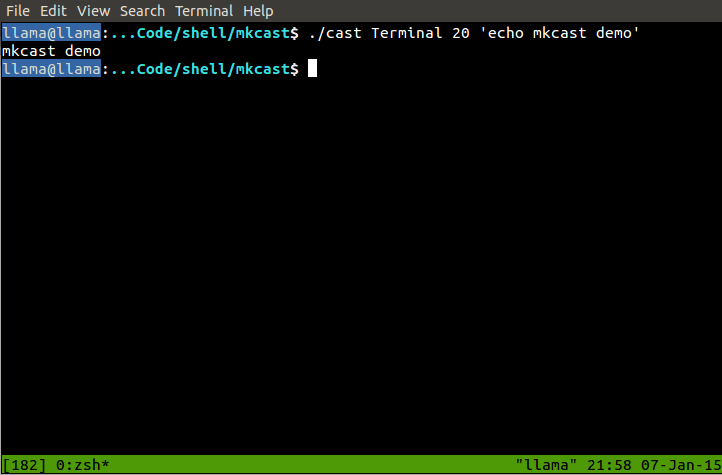

# mkcast

A tool for creating GIF screencasts of a terminal, with key presses overlaid.

Dependencies: `wmctrl`, `byzanz-record` (slightly patched `screenkey` already bundled). Only tested on GNOME on Ubuntu so far.

    $ sudo apt-get install wmctrl byzanz

## Quickstart

    $ sudo make install
    $ newcast  # opens and casts a new terminal window, finishes recording on exit

## How to use

Suggested use: symlink `mkcast` and `newcast` in `/usr/local/bin` (or just run `make install`), and simply type (in GNOME) `Alt+F2 newcast Enter` for a quick mini-cast.

This even allows you to set up a `gnome-terminal` profile called "mkcast," letting you automatically start a command when it opens (such as `vim`) and finish when the command exits, customize the size or colors of the new terminal that is created, etc.

Usage: ./mkcast WINNAME DURATION [COMMAND (optional)]  
Usage: ./newcast [MKCAST ARGS]

Examples:

    # cast the window titled "Terminal" for 10 seconds
    # (omitting -o will default to out.gif, also supports .webm and .ogg)
    ./mkcast Terminal 10 -o out.gif

    # equivalent to the above, but creates a new terminal for you and finishes
    # when the terminal exits instead of after a certain amount of time
    ./newcast

# Why GIF?

I chose GIF because I designed this with the intent that the mini-screencasts be supplemented by text with the full list of keystrokes and an explanation of what's actually happening (specifically, I wrote this with the forthcoming Vim Stack Exchange site in mind).

However, it would be trivial to replace `byzanz-record` with `recordmydesktop` and output real video files. That would defeat the original purpose of being a "mini-screencast," though, since it couldn't be ex. easily embedded in ex. a blog post with no extra work for the reader.

# What does the name mean?

The name has a double meaning: **m**ini-**k**ey-**cast**, or **m**a**k**e cast (like mkdir).
